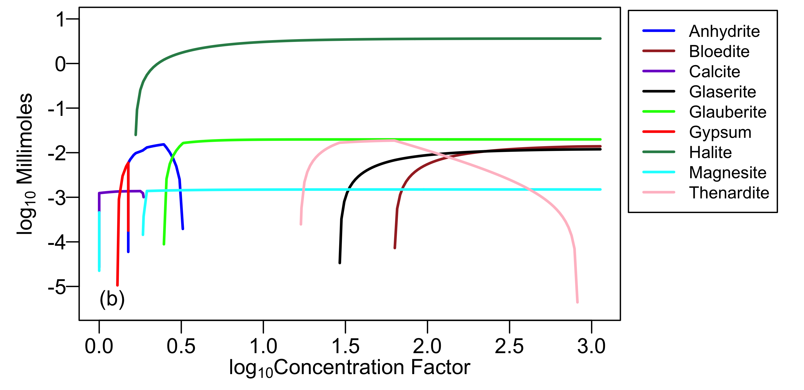
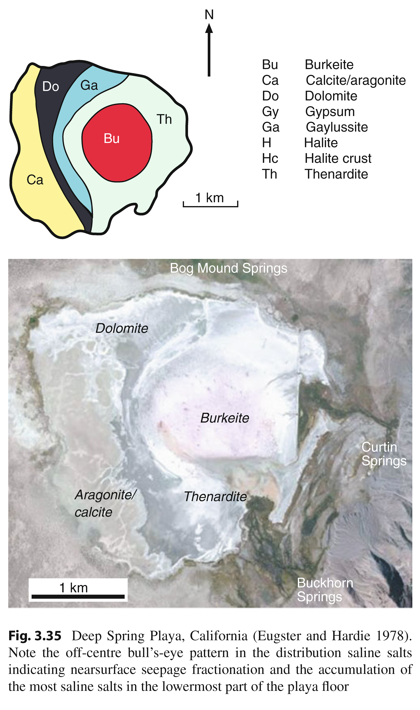

```{r setup, include=FALSE}
knitr::opts_chunk$set(echo = TRUE)
```

## What is an evaporite?
"...a rock that was originally precipitated from a saturated surface or near surface brine by processes driven by solar evaporation (Warren, 1999).

## Formation of evaporites



## Objective of the study


 Image courtesy (Warren,2011).

## Evaporite minerals selected for this study

01.	Anhydrite	    $CaSO_4$					
02.	Aragonite	    $CaCO_3$					
03.	Calcite		$CaCO_3$					
04.	Dolomite	$CaMg(CO_3)_2$					
05.	Epsomite	$MgSO_4.7H_2O$					
06.	Gypsum	$CaSO_4.2H_2O$					
07.	Halite		$NaCl$					
08.	Magnesite	$MgCO_3$					
09.	Thenardite	$Na_2SO_4$					
10.	Trona	$Na_3H(CO_3)_2.2H_2O$

Spectra were collected from different sources (RELAB, USGS, JPL, and from personal collection). Total 100 spectral representing 10 Spectra from each category.

```{r, warning=FALSE,message=FALSE, echo=FALSE}
rm(list = ls())
library(rgdal)
library(hsdar)
library(caret)
library(caretEnsemble)
library(glmnet)
library(Matrix)
library(foreach)
library(e1071)
Spec <-read.csv("Spec.csv", header = FALSE)
specS <-Spec[,-1]
waveS <- as.numeric(Spec[,1])
Eva <- speclib(as.matrix(specS),waveS)
info <- read.csv("Spec_IS.csv", header = TRUE)
ids <- info[,1]
idSpeclib(Eva) <- as.character(ids)
info <- data.frame(info[,])
SI(Eva) <- info
rm(list = grep("^Eva", ls(), value = TRUE, invert = TRUE))
```

## Representative spectra from each mineral type

```{r, echo = FALSE,fig.width= 8}
par(mar = c(5.1, 4.1, 4.1, 8.1), xpd=TRUE)
plot(Eva, FUN = 5, ylim = c(0.0, 1.0), col = 1, main = "Representative Spectra")
plot(Eva, FUN = 13, new = FALSE, col = 2)
plot(Eva, FUN = 23, new = FALSE, col = 3)
plot(Eva, FUN = 34, new = FALSE, col = 4)
plot(Eva, FUN = 45, new = FALSE, col = 5)
plot(Eva, FUN = 56, new = FALSE, col = 6)
plot(Eva, FUN = 67, new = FALSE, col = 7)
plot(Eva, FUN = 78, new = FALSE, col = 8)
plot(Eva, FUN = 89, new = FALSE, col = "deeppink4")
plot(Eva, FUN = 98, new = FALSE, col = "forestgreen")
legend("bottomright",inset = c(-0.25,0), c("Anhydrite", "Aragonite", "Calcite","Dolomite", "Epsomite", "Gypsum", "Halite", "Magnesite", "Thenardite", "Trona"), col = c(1:8, "deeppink4", "forestgreen"), lty = 1, cex = 0.8)
```

## Calculation of absorption band depth

```{r , echo = FALSE, fig.width= 8}
EV56_cont <- transformSpeclib(subset(Eva,ID == "EV56" ), method = "sh", out = "raw")
EV56_depth <- transformSpeclib(subset(Eva,ID == "EV56" ), method = "sh", out = "bd")
par(mfrow = c(2,1))
plot(EV56_cont, ispec = 1, numeratepoints = FALSE, main = "Segmented Hull")
plot(EV56_depth, ispec = 1, numeratepoints = FALSE, main = "Band Depth")
```

## Mineral Spectra

### Anhydrite

```{r, fig.width= 8, fig.height= 8 , echo = FALSE}
par(mfrow = c(2,1))
Anhydrite <- subset(Eva, Type == "Anhydrite")
Anhydrite_depth <- transformSpeclib(Anhydrite, method = "sh", out = "bd")
plot(Anhydrite, FUN = 1, ylim = c(0.4, 1.0), col = 1, main = "Anhydrite Spectra")
plot(Anhydrite, FUN = 2, new = FALSE, col = 2)
plot(Anhydrite, FUN = 3, new = FALSE, col = 3)
plot(Anhydrite, FUN = 4, new = FALSE, col = 4)
plot(Anhydrite, FUN = 5, new = FALSE, col = 5)
plot(Anhydrite, FUN = 6, new = FALSE, col = 6)
plot(Anhydrite, FUN = 7, new = FALSE, col = 7)
plot(Anhydrite, FUN = 8, new = FALSE, col = 8)
plot(Anhydrite, FUN = 9, new = FALSE, col = "deeppink4")
plot(Anhydrite, FUN = 10, new = FALSE, col = "forestgreen")
plot(Anhydrite_depth, FUN = "median", main = "Mean band depth of Anhydrite spectra")
```

### Aragonite

```{r, echo = FALSE, fig.width= 8, fig.height= 8 }
par(mfrow = c(2,1))
Aragonite <- subset(Eva, Type == "Aragonite")
Aragonite_depth <- transformSpeclib(Aragonite, method = "sh", out = "bd")
plot(Aragonite, FUN = 1, ylim = c(0.4, 1.0), col = 1, main = "Aragonite Spectra")
plot(Aragonite, FUN = 2, new = FALSE, col = 2)
plot(Aragonite, FUN = 3, new = FALSE, col = 3)
plot(Aragonite, FUN = 4, new = FALSE, col = 4)
plot(Aragonite, FUN = 5, new = FALSE, col = 5)
plot(Aragonite, FUN = 6, new = FALSE, col = 6)
plot(Aragonite, FUN = 7, new = FALSE, col = 7)
plot(Aragonite, FUN = 8, new = FALSE, col = 8)
plot(Aragonite, FUN = 9, new = FALSE, col = "deeppink4")
plot(Aragonite, FUN = 10, new = FALSE, col = "forestgreen")
plot(Aragonite_depth, FUN = "mean", main = "Mean band depth of aragonite spectra")
```

### Calcite

```{r, echo = FALSE, fig.width= 8, fig.height= 8 }
par(mfrow = c(2,1))
Calcite <- subset(Eva, Type == "Calcite")
Calcite_depth <- transformSpeclib(Calcite, method = "sh", out = "bd")
plot(Calcite, FUN = 1, ylim = c(0.4, 1.0), col = 1, main = "Calcite Spectra")
plot(Calcite, FUN = 2, new = FALSE, col = 2)
plot(Calcite, FUN = 3, new = FALSE, col = 3)
plot(Calcite, FUN = 4, new = FALSE, col = 4)
plot(Calcite, FUN = 5, new = FALSE, col = 5)
plot(Calcite, FUN = 6, new = FALSE, col = 6)
plot(Calcite, FUN = 7, new = FALSE, col = 7)
plot(Calcite, FUN = 8, new = FALSE, col = 8)
plot(Calcite, FUN = 9, new = FALSE, col = "deeppink4")
plot(Calcite, FUN = 10, new = FALSE, col = "forestgreen")
plot(Calcite_depth, FUN = "mean", main = "Mean band depth of calcite spectra")
```

### Dolomite

```{r, echo = FALSE, fig.width= 8, fig.height= 8 }
par(mfrow = c(2,1))
Dolomite <- subset(Eva, Type == "Dolomite")
Dolomite_depth <- transformSpeclib(Dolomite, method = "sh", out = "bd")
plot(Dolomite, FUN = 1, ylim = c(0.1, 1.0), col = 1, main = "Dolomite Spectra")
plot(Dolomite, FUN = 2, new = FALSE, col = 2)
plot(Dolomite, FUN = 3, new = FALSE, col = 3)
plot(Dolomite, FUN = 4, new = FALSE, col = 4)
plot(Dolomite, FUN = 5, new = FALSE, col = 5)
plot(Dolomite, FUN = 6, new = FALSE, col = 6)
plot(Dolomite, FUN = 7, new = FALSE, col = 7)
plot(Dolomite, FUN = 8, new = FALSE, col = 8)
plot(Dolomite, FUN = 9, new = FALSE, col = "deeppink4")
plot(Dolomite, FUN = 10, new = FALSE, col = "forestgreen")
plot(Dolomite_depth, FUN = "mean", main = "Mean band depth of dolomite spectra")
```

### Epsomite

```{r, echo = FALSE, fig.width= 8, fig.height= 8 }
par(mfrow = c(2,1))
Epsomite <- subset(Eva, Type == "Epsomite")
Epsomite_depth <- transformSpeclib(Epsomite, method = "sh", out = "bd")
plot(Epsomite, FUN = 1, ylim = c(0.0, 1.0), col = 1, main = "Epsomite Spectra")
plot(Epsomite, FUN = 2, new = FALSE, col = 2)
plot(Epsomite, FUN = 3, new = FALSE, col = 3)
plot(Epsomite, FUN = 4, new = FALSE, col = 4)
plot(Epsomite, FUN = 5, new = FALSE, col = 5)
plot(Epsomite, FUN = 6, new = FALSE, col = 6)
plot(Epsomite, FUN = 7, new = FALSE, col = 7)
plot(Epsomite, FUN = 8, new = FALSE, col = 8)
plot(Epsomite, FUN = 9, new = FALSE, col = "deeppink4")
plot(Epsomite, FUN = 10, new = FALSE, col = "forestgreen")
plot(Epsomite_depth, FUN = "mean", main = "Mean band depths of epsomite spectra")
```

### Gypsum

```{r, echo = FALSE, fig.width= 8, fig.height= 8 }
par(mfrow = c(2,1))
Gypsum <- subset(Eva, Type == "Gypsum")
Gypsum_depth <- transformSpeclib(Gypsum, method = "sh", out = "bd")
plot(Gypsum, FUN = 1, ylim = c(0.0, 1.0), col = 1, main = "Gypsum Spectra")
plot(Gypsum, FUN = 2, new = FALSE, col = 2)
plot(Gypsum, FUN = 3, new = FALSE, col = 3)
plot(Gypsum, FUN = 4, new = FALSE, col = 4)
plot(Gypsum, FUN = 5, new = FALSE, col = 5)
plot(Gypsum, FUN = 6, new = FALSE, col = 6)
plot(Gypsum, FUN = 7, new = FALSE, col = 7)
plot(Gypsum, FUN = 8, new = FALSE, col = 8)
plot(Gypsum, FUN = 9, new = FALSE, col = "deeppink4")
plot(Gypsum, FUN = 10, new = FALSE, col = "forestgreen")
plot(Gypsum_depth, FUN = "mean", main = "Mean band depth of gypsum spectra")
```

### Halite

```{r, echo = FALSE, fig.width= 8, fig.height= 8 }
par(mfrow = c(2,1))
Halite <- subset(Eva, Type == "Halite")
Halite_depth <- transformSpeclib(Halite, method = "sh", out = "bd")
plot(Halite, FUN = 1, ylim = c(0.0, 1.0), col = 1, main = "Halite Spectra")
plot(Halite, FUN = 2, new = FALSE, col = 2)
plot(Halite, FUN = 3, new = FALSE, col = 3)
plot(Halite, FUN = 4, new = FALSE, col = 4)
plot(Halite, FUN = 5, new = FALSE, col = 5)
plot(Halite, FUN = 6, new = FALSE, col = 6)
plot(Halite, FUN = 7, new = FALSE, col = 7)
plot(Halite, FUN = 8, new = FALSE, col = 8)
plot(Halite, FUN = 9, new = FALSE, col = "deeppink4")
plot(Halite, FUN = 10, new = FALSE, col = "forestgreen")
plot(Halite_depth, FUN = "mean", main = "Mean band depth of halite spectra")
```

### Magnesite

```{r, echo = FALSE, fig.width= 8, fig.height= 8 }
par(mfrow = c(2,1))
Magnesite <- subset(Eva, Type == "Magnesite")
Magnesite_depth <- transformSpeclib(Magnesite, method = "sh", out = "bd")
plot(Magnesite, FUN = 1, ylim = c(0.3, 1.0), col = 1, main = "Magnesite Spectra")
plot(Magnesite, FUN = 2, new = FALSE, col = 2)
plot(Magnesite, FUN = 3, new = FALSE, col = 3)
plot(Magnesite, FUN = 4, new = FALSE, col = 4)
plot(Magnesite, FUN = 5, new = FALSE, col = 5)
plot(Magnesite, FUN = 6, new = FALSE, col = 6)
plot(Magnesite, FUN = 7, new = FALSE, col = 7)
plot(Magnesite, FUN = 8, new = FALSE, col = 8)
plot(Magnesite, FUN = 9, new = FALSE, col = "deeppink4")
plot(Magnesite, FUN = 10, new = FALSE, col = "forestgreen")
plot(Magnesite_depth, FUN = "mean", main = "Mean band depth of magnesite spectra")
```

### Thenardite

```{r, echo = FALSE, fig.width= 8, fig.height= 8 }
par(mfrow = c(2,1))
Thenardite <- subset(Eva, Type == "Thenardite")
Thenardite_depth <- transformSpeclib(Thenardite, method = "sh", out = "bd")
plot(Thenardite, FUN = 1, ylim = c(0.3, 1.0), col = 1, main = "Thenardite Spectra")
plot(Thenardite, FUN = 2, new = FALSE, col = 2)
plot(Thenardite, FUN = 3, new = FALSE, col = 3)
plot(Thenardite, FUN = 4, new = FALSE, col = 4)
plot(Thenardite, FUN = 5, new = FALSE, col = 5)
plot(Thenardite, FUN = 6, new = FALSE, col = 6)
plot(Thenardite, FUN = 7, new = FALSE, col = 7)
plot(Thenardite, FUN = 8, new = FALSE, col = 8)
plot(Thenardite, FUN = 9, new = FALSE, col = "deeppink4")
plot(Thenardite, FUN = 10, new = FALSE, col = "forestgreen")
plot(Thenardite_depth, FUN = "mean", main = "Mean band depth of thenardite spectra")
```

### Trona

```{r, echo = FALSE, fig.width= 8, fig.height= 8 }
par(mfrow = c(2,1))
Trona <- subset(Eva, Type == "Trona")
Trona_depth <- transformSpeclib(Trona, method = "sh", out = "bd")
plot(Trona, FUN = 1, ylim = c(0.0, 1.0), col = 1, main = "Trona Spectra")
plot(Trona, FUN = 2, new = FALSE, col = 2)
plot(Trona, FUN = 3, new = FALSE, col = 3)
plot(Trona, FUN = 4, new = FALSE, col = 4)
plot(Trona, FUN = 5, new = FALSE, col = 5)
plot(Trona, FUN = 6, new = FALSE, col = 6)
plot(Trona, FUN = 7, new = FALSE, col = 7)
plot(Trona, FUN = 8, new = FALSE, col = 8)
plot(Trona, FUN = 9, new = FALSE, col = "deeppink4")
plot(Trona, FUN = 10, new = FALSE, col = "forestgreen")
plot(Trona_depth, FUN = "mean", main = "Mean band depth of trona spectra")
```

## Mean band depths of all mineral spectra

```{r, echo = FALSE, fig.width= 8}
par(mar = c(5.1, 4.1, 4.1, 8.1), xpd=TRUE)
plot(Anhydrite_depth, FUN = "median",ylim = c(-0.2, 0.8), main = "Representative band depths of evaporite spectra", col = 1)
plot(Aragonite_depth, FUN = "median", new = FALSE, col = 2)
plot(Calcite_depth, FUN = "median", new = FALSE, col = 3)
plot(Dolomite_depth, FUN = "median",new = FALSE, col = 4)
plot(Epsomite_depth, FUN = "median", new = FALSE, col = 5)
plot(Gypsum_depth, FUN = "median", new = FALSE, col = 6)
plot(Halite_depth, FUN = "median", new = FALSE, col = 7)
plot(Magnesite_depth, FUN = "median", new = FALSE, col = 8)
plot(Thenardite_depth, FUN = "median", new = FALSE, col = "deeppink4")
plot(Trona_depth, FUN = "median", new = FALSE, col = "forestgreen")
legend("topright",inset = c(-0.25,0), c("Anhydrite", "Aragonite", "Calcite","Dolomite", "Epsomite", "Gypsum", "Halite", "Magnesite", "Thenardite", "Trona"), col = c(1:8, "deeppink4", "forestgreen"), lty = 1, cex = 0.8)
```


## Most interested wavelength regions based on the 100 evaporite Spectra

```{r, echo= FALSE}
Eva_depth <- transformSpeclib(Eva, method = "sh", out = "bd")
plot(Eva_depth, FUN = "var")
```

## Selected multispectral sensors

1. Landsat 5 (NASA)
2. Landsat 7 ETM+ (NASA)
3. Landsat 8 OLI (NASA)
4. EO-1 ALI (NASA)
5. Sentinel-2 (ESA)
6. ASTER (NASA + JAXA)

## Spectral response function of multispectral sensors

```{r, echo = FALSE}
ASTBF <- read.csv("ASTBF.csv", header = TRUE)
AST <- read.csv("ASTER.csv", header = TRUE)
AST <- data.frame(Name = AST$ID, sep = "", center = AST$center, fwhm = AST$HWHM)
Spec_Response <- get.gaussian.response(AST)
plot(ASTBF$Resp ~ ASTBF$WL, new = FALSE, type="l", xlab = "Wavelength (nm)", ylab = "Spectral Response", main = "Spectral Response of ASTER SWIR Bands")
xwl_response <- seq.int(attr(Spec_Response, "minwl"), attr(Spec_Response, "maxwl"), attr(Spec_Response, "stepsize"))
for (i in 1:9)
  lines(xwl_response, Spec_Response[,i], col = i)
#dev.off()
```

### Landsat 5

```{r, echo=FALSE, fig.height= 8}
#png("Landsat5.png", width=3200, height=4000, res=400)
par(mfrow = c(2,1), xpd = TRUE)
L5 <- read.csv("L5.csv", header = TRUE)
L5 <- data.frame(Name = L5$ID, center = L5$center, fwhm = L5$HWHM)
Spec_ResponseL5 <- get.gaussian.response(L5)
plot(c(0,1) ~ c(400, 2500), type = "n", xlab = "Wavelength (nm)", ylab = "Spectral Response", main = "Spectral Response of Landsat 5 Bands")
xwl_response <- seq.int(attr(Spec_ResponseL5, "minwl"), attr(Spec_ResponseL5, "maxwl"), attr(Spec_ResponseL5, "stepsize"))
for (i in 1:6)
  lines(xwl_response, Spec_ResponseL5[,i], col = i)
L5resample <- spectralResampling(Eva, L5, rm.NA = TRUE, continuousdata = TRUE, response_function = FALSE)
plot(L5resample, FUN = 5, ylim = c(0.0,1.0), xlim = c(400, 2500), col= "purple",main = "After resampling into Landsat 5 bands")
plot(L5resample, FUN = 13, new = FALSE, col = 2)
plot(L5resample, FUN = 23, new = FALSE, col = 3)
plot(L5resample, FUN = 34, new = FALSE, col = 4)
plot(L5resample, FUN = 45, new = FALSE, col = 5)
plot(L5resample, FUN = 56, new = FALSE, col = 6)
plot(L5resample, FUN = 67, new = FALSE, col = 7)
plot(L5resample, FUN = 78, new = FALSE, col = 8)
plot(L5resample, FUN = 89, new = FALSE, col = "deeppink4")
plot(L5resample, FUN = 98, new = FALSE, col = "forestgreen")
legend("bottomright",inset = c(-0.06,0.01), c("Anhydrite", "Aragonite", "Calcite","Dolomite", "Epsomite", "Gypsum", "Halite", "Magnesite", "Thenardite", "Trona"), col = c(1:8, "deeppink4", "forestgreen"), lty = 1, cex = 0.8, bg = "white")
si <- read.csv("Spec_IS.csv", header = TRUE)
L5spec <-(data.frame(spectra(L5resample)))
L5wave <-data.frame(wavelength(L5resample))
L5si <-data.frame(SI(L5resample))
L5bands <- cbind(L5si, L5spec)
colnames(L5bands)[7] <- "L5_485"
colnames(L5bands)[8] <- "L5_569"
colnames(L5bands)[9] <- "L5_660"
colnames(L5bands)[10] <- "L5_840"
colnames(L5bands)[11] <- "L5_1676"
colnames(L5bands)[12] <- "L5_2223"
#write.csv(L5bands, file = "L5bands.csv")
#dev.off()
```

### Landsat 7

```{r, echo=FALSE , fig.height= 8}
par(mfrow = c(2,1), xpd = TRUE)
L7 <- read.csv("L7.csv", header = TRUE)
L7 <- data.frame(Name = L7$ID, center = L7$center, fwhm = L7$HWHM)
Spec_ResponseL7 <- get.gaussian.response(L7)
plot(c(0,1) ~ c(400, 2500), type = "n", xlab = "Wavelength (nm)", ylab = "Spectral Response", main = "Spectral Response of Landsat 7 Bands")
xwl_response <- seq.int(attr(Spec_ResponseL7, "minwl"), attr(Spec_ResponseL7, "maxwl"), attr(Spec_ResponseL7, "stepsize"))
for (i in 1:6)
  lines(xwl_response, Spec_ResponseL7[,i], col = i)
L7resample <- spectralResampling(Eva, L7, rm.NA = TRUE, continuousdata = TRUE, response_function = FALSE)
plot(L7resample, FUN = 5, ylim = c(0.0,1.0),xlim = c(400, 2500), col= "purple",main = "After resampling into Landsat 7 bands")
plot(L7resample, FUN = 13, new = FALSE, col = 2)
plot(L7resample, FUN = 23, new = FALSE, col = 3)
plot(L7resample, FUN = 34, new = FALSE, col = 4)
plot(L7resample, FUN = 45, new = FALSE, col = 5)
plot(L7resample, FUN = 56, new = FALSE, col = 6)
plot(L7resample, FUN = 67, new = FALSE, col = 7)
plot(L7resample, FUN = 78, new = FALSE, col = 8)
plot(L7resample, FUN = 89, new = FALSE, col = "deeppink4")
plot(L7resample, FUN = 98, new = FALSE, col = "forestgreen")
legend("bottomright",inset = c(-0.06,0.01), c("Anhydrite", "Aragonite", "Calcite","Dolomite", "Epsomite", "Gypsum", "Halite", "Magnesite", "Thenardite", "Trona"), col = c(1:8, "deeppink4", "forestgreen"), lty = 1, cex = 0.8, bg = "white")
si <- read.csv("Spec_IS.csv", header = TRUE)
L7spec <-(data.frame(spectra(L7resample)))
L7wave <-data.frame(wavelength(L7resample))
L7si <-data.frame(SI(L7resample))
L7bands <- cbind(L7si, L7spec)
colnames(L7bands)[7] <- "L7_483"
colnames(L7bands)[8] <- "L7_560"
colnames(L7bands)[9] <- "L7_662"
colnames(L7bands)[10] <- "L7_835"
colnames(L7bands)[11] <- "L7_1648"
colnames(L7bands)[12] <- "L7_2206"
#write.csv(L7bands, file = "L7bands.csv")
#dev.off()
```

### Landsat 8

```{r, echo=FALSE , fig.height= 8}
par(mfrow = c(2,1), xpd = TRUE)
L8 <- read.csv("L8.csv", header = TRUE)
L8 <- data.frame(Name = L8$ID, center = L8$center, fwhm = L8$HWHM)
Spec_ResponseL8 <- get.gaussian.response(L8)
plot(c(0,1) ~ c(400, 2500), type = "n", xlab = "Wavelength (nm)", ylab = "Spectral Response", main = "Spectral Response of Landsat 8 Bands")
xwl_response <- seq.int(attr(Spec_ResponseL8, "minwl"), attr(Spec_ResponseL8, "maxwl"), attr(Spec_ResponseL8, "stepsize"))
for (i in 1:8)
  lines(xwl_response, Spec_ResponseL8[,i], col = i)
L8resample <- spectralResampling(Eva, L8, rm.NA = TRUE, continuousdata = TRUE, response_function = FALSE)
plot(L8resample, FUN = 5, ylim = c(0.0,1.0),xlim = c(400, 2500), col= "purple",main = "After resampling into Landsat 8 bands")
plot(L8resample, FUN = 13, new = FALSE, col = 2)
plot(L8resample, FUN = 23, new = FALSE, col = 3)
plot(L8resample, FUN = 34, new = FALSE, col = 4)
plot(L8resample, FUN = 45, new = FALSE, col = 5)
plot(L8resample, FUN = 56, new = FALSE, col = 6)
plot(L8resample, FUN = 67, new = FALSE, col = 7)
plot(L8resample, FUN = 78, new = FALSE, col = 8)
plot(L8resample, FUN = 89, new = FALSE, col = "deeppink4")
plot(L8resample, FUN = 98, new = FALSE, col = "forestgreen")
legend("bottomright",inset = c(-0.06,0.01), c("Anhydrite", "Aragonite", "Calcite","Dolomite", "Epsomite", "Gypsum", "Halite", "Magnesite", "Thenardite", "Trona"), col = c(1:8, "deeppink4", "forestgreen"), lty = 1, cex = 0.8, bg = "white")
si <- read.csv("Spec_IS.csv", header = TRUE)
L8spec <-(data.frame(spectra(L8resample)))
L8wave <-data.frame(wavelength(L8resample))
L8si <-data.frame(SI(L8resample))
L8bands <- cbind(L8si, L8spec)
colnames(L8bands)[7] <- "L8_443"
colnames(L8bands)[8] <- "L8_483"
colnames(L8bands)[9] <- "L8_563"
colnames(L8bands)[10] <- "L8_655"
colnames(L8bands)[11] <- "L8_865"
colnames(L8bands)[12] <- "L8_1375"
colnames(L8bands)[13] <- "L8_1610"
colnames(L8bands)[14] <- "L8_2200"
#write.csv(L8bands, file = "L8bands.csv")
#dev.off()
```

### Sentinel-2 


```{r, echo=FALSE, , fig.height= 8}
par(mfrow = c(2,1), xpd = TRUE)
MSI <- read.csv("MSI.csv", header = TRUE)
MSI <- data.frame(Name = MSI$ID, center = MSI$center, fwhm = MSI$HWHM)
Spec_ResponseMSI <- get.gaussian.response(MSI)
plot(c(0,1) ~ c(400, 2500), type = "n", xlab = "Wavelength (nm)", ylab = "Spectral Response", main = "Spectral Response of Sentinel-2 Bands")
xwl_response <- seq.int(attr(Spec_ResponseMSI, "minwl"), attr(Spec_ResponseMSI, "maxwl"), attr(Spec_ResponseMSI, "stepsize"))
for (i in 1:10)
  lines(xwl_response, Spec_ResponseMSI[,i], col = i)
MSIresample <- spectralResampling(Eva, MSI, rm.NA = TRUE, continuousdata = TRUE, response_function = FALSE)
plot(MSIresample, FUN = 5, ylim = c(0.0,1.0),xlim = c(400, 2500), col= "purple",main = "After resampling in to Sentinel-2 bands")
plot(MSIresample, FUN = 13, new = FALSE, col = 2)
plot(MSIresample, FUN = 23, new = FALSE, col = 3)
plot(MSIresample, FUN = 34, new = FALSE, col = 4)
plot(MSIresample, FUN = 45, new = FALSE, col = 5)
plot(MSIresample, FUN = 56, new = FALSE, col = 6)
plot(MSIresample, FUN = 67, new = FALSE, col = 7)
plot(MSIresample, FUN = 78, new = FALSE, col = 8)
plot(MSIresample, FUN = 89, new = FALSE, col = "deeppink4")
plot(MSIresample, FUN = 98, new = FALSE, col = "forestgreen")
legend("bottomright",inset = c(-0.06,0.01), c("Anhydrite", "Aragonite", "Calcite","Dolomite", "Epsomite", "Gypsum", "Halite", "Magnesite", "Thenardite", "Trona"), col = c(1:8, "deeppink4", "forestgreen"), lty = 1, cex = 0.8, bg = "white")
si <- read.csv("Spec_IS.csv", header = TRUE)
MSIspec <-(data.frame(spectra(MSIresample)))
MSIwave <-data.frame(wavelength(MSIresample))
MSIsi <-data.frame(SI(MSIresample))
MSIbands <- cbind(MSIsi, MSIspec)
colnames(MSIbands)[7] <- "MSI_492"
colnames(MSIbands)[8] <- "MSI_559"
colnames(MSIbands)[9] <- "MSI_664"
colnames(MSIbands)[10] <- "MSI_704"
colnames(MSIbands)[11] <- "MSI_740"
colnames(MSIbands)[12] <- "MSI_782"
colnames(MSIbands)[13] <- "MSI_832"
colnames(MSIbands)[14] <- "MSI_864"
colnames(MSIbands)[15] <- "MSI_1613"
colnames(MSIbands)[16] <- "MSI_2202"
#write.csv(MSIbands, file = "MSIbands.csv")
#dev.off()
```

### ALI (Advanced Land Imager) 

```{r, echo=FALSE, , fig.height= 8}
par(mfrow = c(2,1), xpd =TRUE)
ALI <- read.csv("ALI.csv", header = TRUE)
ALI <- data.frame(Name = ALI$ID, center = ALI$center, fwhm = ALI$HWHM)
Spec_ResponseALI <- get.gaussian.response(ALI)
plot(c(0,1) ~ c(400, 2500), type = "n", xlab = "Wavelength (nm)", ylab = "Spectral Response", main = "Spectral Response of ALI Bands")
xwl_response <- seq.int(attr(Spec_ResponseALI, "minwl"), attr(Spec_ResponseALI, "maxwl"), attr(Spec_ResponseALI, "stepsize"))
for (i in 1:9)
  lines(xwl_response, Spec_ResponseALI[,i], col = i)
ALIresample <- spectralResampling(Eva, ALI, rm.NA = TRUE, continuousdata = TRUE, response_function = FALSE)
plot(ALIresample, FUN = 5, ylim = c(0.0,1.0),xlim = c(400, 2500), col= "purple",main = "After resampling into ALI bands")
plot(ALIresample, FUN = 13, new = FALSE, col = 2)
plot(ALIresample, FUN = 23, new = FALSE, col = 3)
plot(ALIresample, FUN = 34, new = FALSE, col = 4)
plot(ALIresample, FUN = 45, new = FALSE, col = 5)
plot(ALIresample, FUN = 56, new = FALSE, col = 6)
plot(ALIresample, FUN = 67, new = FALSE, col = 7)
plot(ALIresample, FUN = 78, new = FALSE, col = 8)
plot(ALIresample, FUN = 89, new = FALSE, col = "deeppink4")
plot(ALIresample, FUN = 98, new = FALSE, col = "forestgreen")
legend("bottomright",inset = c(-0.06,0.01), c("Anhydrite", "Aragonite", "Calcite","Dolomite", "Epsomite", "Gypsum", "Halite", "Magnesite", "Thenardite", "Trona"), col = c(1:8, "deeppink4", "forestgreen"), lty = 1, cex = 0.8, bg = "white")
si <- read.csv("Spec_IS.csv", header = TRUE)
ALIspec <-(data.frame(spectra(ALIresample)))
ALIwave <-data.frame(wavelength(ALIresample))
ALIsi <-data.frame(SI(ALIresample))
ALIbands <- cbind(ALIsi, ALIspec)
colnames(ALIbands)[7] <- "ALI_443"
colnames(ALIbands)[8] <- "ALI_483"
colnames(ALIbands)[9] <- "ALI_565"
colnames(ALIbands)[10] <- "ALI_662"
colnames(ALIbands)[11] <- "ALI_790"
colnames(ALIbands)[12] <- "ALI_868"
colnames(ALIbands)[13] <- "ALI_1250"
colnames(ALIbands)[14] <- "ALI_1650"
colnames(ALIbands)[15] <- "ALI_2215"
#write.csv(ALIbands, file = "ALIbands.csv")
#dev.off()
```

### ASTER (Advanced Spaceborne Thermal Emission and Reflection Radiometer) 

```{r, echo=FALSE, , fig.height= 8}
#png("ASTER.png", width=3200, height=4000, res=400)
par(mfrow = c(2,1), xpd = TRUE)
AST <- read.csv("ASTER.csv", header = TRUE)
AST <- data.frame(Name = AST$ID, center = AST$center, fwhm = AST$HWHM)
Spec_ResponseAST <- get.gaussian.response(AST)

plot(c(0,1) ~ c(400, 2500), type = "n", xlab = "Wavelength (nm)", ylab = "Spectral Response", main = "Spectral Response of ASTER Bands")
xwl_response <- seq.int(attr(Spec_ResponseAST, "minwl"), attr(Spec_ResponseAST, "maxwl"), attr(Spec_ResponseAST, "stepsize"))
for (i in 1:9)
  lines(xwl_response, Spec_ResponseAST[,i], col = i)
ASTresample <- spectralResampling(Eva, AST, rm.NA = TRUE, continuousdata = TRUE, response_function = FALSE)
plot(ASTresample, FUN = 5, ylim = c(0.0,1.0),xlim = c(400, 2500), col= "purple",main = "After resampling into ASTER bands")
plot(ASTresample, FUN = 13, new = FALSE, col = 2)
plot(ASTresample, FUN = 23, new = FALSE, col = 3)
plot(ASTresample, FUN = 34, new = FALSE, col = 4)
plot(ASTresample, FUN = 45, new = FALSE, col = 5)
plot(ASTresample, FUN = 56, new = FALSE, col = 6)
plot(ASTresample, FUN = 67, new = FALSE, col = 7)
plot(ASTresample, FUN = 78, new = FALSE, col = 8)
plot(ASTresample, FUN = 89, new = FALSE, col = "deeppink4")
plot(ASTresample, FUN = 98, new = FALSE, col = "forestgreen")
legend("bottomleft",inset = c(-0.001,0.01), c("Anhydrite", "Aragonite", "Calcite","Dolomite", "Epsomite", "Gypsum", "Halite", "Magnesite", "Thenardite", "Trona"), col = c(1:8, "deeppink4", "forestgreen"), lty = 1, cex = 0.6, bg = "white")
si <- read.csv("Spec_IS.csv", header = TRUE)
ASTspec <-(data.frame(spectra(ASTresample)))
ASTwave <-data.frame(wavelength(ASTresample))
ASTsi <-data.frame(SI(ASTresample))
ASTbands <- cbind(ASTsi, ASTspec)
colnames(ASTbands)[7] <- "AST_560"
colnames(ASTbands)[8] <- "AST_660"
colnames(ASTbands)[9] <- "AST_810"
colnames(ASTbands)[10] <- "AST_1650"
colnames(ASTbands)[11] <- "AST_2165"
colnames(ASTbands)[12] <- "AST_2205"
colnames(ASTbands)[13] <- "AST_2260"
colnames(ASTbands)[14] <- "AST_2330"
colnames(ASTbands)[15] <- "AST_2395"
#dev.off()
```


## Finding the best band index

### 7 band indices were calculated.

1. AngleA = Angle between the overall spectral trend and horizontal plane.
2. AngleB = Angle created by three nearby bands centered at ~ 550 nm wavelength (660 nm for ASTER)
3. AngleC = Angle created by three nearby bands centered at ~ 850 nm wavelength
4. AngleD = Angle created by three nearby bands centered at ~ 1650 nm wavelength


Additional band indices for ASTER data,

5. AngleE = Angle created by three nearby bands centered at ~ 1650 nm wavelength
6. AngleF = Angle created by three nearby bands centered at ~ 2205 nm wavelength
7. AngleG = Angle created by three nearby bands centered at ~ 2330 nm wavelength


Learning Vector Quantization (LVQ) model was used to estimate the feature importance.
k-fold cross validation method was adopted (k = 10, 3 repeats)

### 3 Machine learning methods were used,
1. RandomForest (rf)
2. Neural Network (nnet)
3. Support Vector Machine (svmRadial)

k-fold cross validation method was adopted (k = 10, 3 repeats)

```{r, echo=FALSE}
L5bands <- L5bands[,c(2, 7:12)]
L5bands$AngleA <- atan2(1.738,(L5bands$L5_485 - L5bands$L5_2223))*180/pi

AngleT1 <- atan2((L5bands$L5_660 - L5bands$L5_569),0.091)*180/pi
AngleT2 <- atan2(0.084,(L5bands$L5_569 - L5bands$L5_485))*180/pi
L5bands$AngleB <- AngleT2 + AngleT1 + 90

AngleT1 <- atan2((L5bands$L5_1676 - L5bands$L5_840),0.836)*180/pi
AngleT2 <- atan2(0.180,(L5bands$L5_840 - L5bands$L5_660))*180/pi
L5bands$AngleC <- AngleT2 + AngleT1 + 90

AngleT1 <- atan2((L5bands$L5_2223 - L5bands$L5_1676),0.547)*180/pi
AngleT2 <- atan2(0.836,(L5bands$L5_1676 - L5bands$L5_840))*180/pi
L5bands$AngleD <- AngleT2 + AngleT1 + 90
L5bands$Type = factor(L5bands$Type)
L5_bands <- L5bands[,c(1, 8:11)]
```

#### Importance of selected band indices: Landsat 5


```{r, echo=FALSE, results='hide', warning=FALSE, fig.width= 8, fig.height= 4, fig.align='center'}
set.seed(12345)
control <- trainControl(method="repeatedcv", number=10, repeats=3)
model <- train(Type ~., data= L5_bands, method="lvq", preProcess="scale", trControl=control)
L5.importance <- varImp(model, scale=FALSE)
plot(L5.importance)
#dev.off()
```

#### Performance of selected Machine Learning models: Landsat 5

```{r, echo= FALSE, results='hide', warning=FALSE, fig.width= 5, fig.height= 3, fig.align='center'}
L5_index <- createDataPartition(L5_bands$Type , p = 0.8, list = FALSE)
L5_Test <-L5_bands[-L5_index,]
L5_Train <-L5_bands[L5_index,]
trainControl <- trainControl(method="repeatedcv", 
                             number=10, 
                             repeats=3,
                             savePredictions=TRUE, 
                             classProbs=TRUE)
metric <- "Accuracy"
set.seed(12345)
L5.models <- caretList(Type ~ ., data = L5_Train, trControl=trainControl, methodList= c('rf', 'nnet','svmRadial'))
L5.results <- resamples(L5.models)
#L5_results <- as.data.frame(L5.results)
dotplot(L5.results)
```

```{r, echo=FALSE}
L7bands <- L7bands[,c(2, 7:12)]
L7bands$AngleA <- atan2(1.723,(L7bands$L7_483 - L7bands$L7_2206))*180/pi

AngleT1 <- atan2((L7bands$L7_662 - L7bands$L7_560),0.102)*180/pi
AngleT2 <- atan2(0.077,(L7bands$L7_560 - L7bands$L7_483))*180/pi
L7bands$AngleB <- AngleT2 + AngleT1 + 90

AngleT1 <- atan2((L7bands$L7_1648- L7bands$L7_835),0.812)*180/pi
AngleT2 <- atan2(0.173,(L7bands$L7_835 - L7bands$L7_662))*180/pi
L7bands$AngleC <- AngleT2 + AngleT1 + 90

AngleT1 <- atan2((L7bands$L7_2206 - L7bands$L7_1648),0.558)*180/pi
AngleT2 <- atan2(0.813,(L7bands$L7_1648 - L7bands$L7_835))*180/pi
L7bands$AngleD <- AngleT2 + AngleT1 + 90
L7bands$Type = factor(L7bands$Type)
L7_bands <- L7bands[,c(1, 8:11)]
```

#### Importance of selected band indices: Landsat 7

```{r, echo=FALSE, results='hide', warning=FALSE, fig.width= 8, fig.height= 4, fig.align='center'}
set.seed(12345)
control <- trainControl(method="repeatedcv", number=10, repeats=3)
model <- train(Type ~., data= L7_bands, method="lvq", preProcess="scale", trControl=control)
L7.importance <- varImp(model, scale=FALSE)
plot(L7.importance)
#dev.off()
```

#### Performance of selected Machine Learning models: Landsat 7

```{r, echo= FALSE, results='hide', warning=FALSE, fig.width= 5, fig.height= 3, fig.align='center'}
L7_index <- createDataPartition(L7_bands$Type , p = 0.8, list = FALSE)
L7_Test <-L7_bands[-L7_index,]
L7_Train <-L7_bands[L7_index,]
trainControl <- trainControl(method="repeatedcv", 
                             number=10, 
                             repeats=3,
                             savePredictions=TRUE, 
                             classProbs=TRUE)
metric <- "Accuracy"
set.seed(12345)
L7.models <- caretList(Type ~ ., data = L7_Train, trControl=trainControl, methodList= c('rf', 'nnet','svmRadial'))
L7.results <- resamples(L7.models)
#L5_results <- as.data.frame(L5.results)
dotplot(L7.results)
```

```{r, echo=FALSE, results='hide', warning=FALSE}
L8bands <- L8bands[,c(2, 7:14)]
L8bands$AngleA <- atan2(1.757,(L8bands$L8_443 - L8bands$L8_2200))*180/pi

AngleT1 <- atan2((L8bands$L8_655 - L8bands$L8_563),0.092)*180/pi
AngleT2 <- atan2(0.120,(L8bands$L8_563 - L8bands$L8_443))*180/pi
L8bands$AngleB <- AngleT2 + AngleT1 + 90

AngleT1 <- atan2((L8bands$L8_1610 - L8bands$L8_1375),0.235)*180/pi
AngleT2 <- atan2(0.510,(L8bands$L8_1375 - L8bands$L8_865))*180/pi
L8bands$AngleC <- AngleT2 + AngleT1 + 90

AngleT1 <- atan2((L8bands$L8_2200 - L8bands$L8_1610),0.590)*180/pi
AngleT2 <- atan2(0.235,(L8bands$L8_1610 - L8bands$L8_1375))*180/pi
L8bands$AngleD <- AngleT2 + AngleT1 + 90
L8bands$Type = factor(L8bands$Type)
L8_bands <- L8bands[,c(1, 10:13)]
```

#### Importance of selected band indices: Landsat 8

```{r, echo=FALSE, results='hide', warning=FALSE, fig.width= 8, fig.height= 4, fig.align='center'}
set.seed(12345)
control <- trainControl(method="repeatedcv", number=10, repeats=3)
model <- train(Type ~., data= L8_bands, method="lvq", preProcess="scale", trControl=control)
L8.importance <- varImp(model, scale=FALSE)
plot(L8.importance)
#dev.off()
```

#### Performance of selected Machine Learning models: Landsat 8

```{r, echo= FALSE, results='hide', warning=FALSE, fig.width= 5, fig.height= 3, fig.align='center'}
L8_index <- createDataPartition(L8_bands$Type , p = 0.8, list = FALSE)
L8_Test <-L8_bands[-L8_index,]
L8_Train <-L8_bands[L8_index,]
trainControl <- trainControl(method="repeatedcv", 
                             number=10, 
                             repeats=3,
                             savePredictions=TRUE, 
                             classProbs=TRUE)
metric <- "Accuracy"
set.seed(12345)
L8.models <- caretList(Type ~ ., data = L8_Train, trControl=trainControl, methodList= c('rf', 'nnet','svmRadial'))
L8.results <- resamples(L8.models)
dotplot(L8.results)
```

```{r, echo=FALSE, results='hide', warning=FALSE}
MSIbands <- MSIbands[,c(2, 7:16)]
MSIbands$AngleA <- atan2(1.710,(MSIbands$MSI_492 - MSIbands$MSI_2202))*180/pi

AngleT1 <- atan2((MSIbands$MSI_664 - MSIbands$MSI_559),0.105)*180/pi
AngleT2 <- atan2(0.067,(MSIbands$MSI_559 - MSIbands$MSI_492))*180/pi
MSIbands$AngleB <- AngleT2 + AngleT1 + 90

AngleT1 <- atan2((MSIbands$MSI_864 - MSIbands$MSI_832),0.032)*180/pi
AngleT2 <- atan2(0.05,(MSIbands$MSI_832 - MSIbands$MSI_782))*180/pi
MSIbands$AngleC <- AngleT2 + AngleT1 + 90

AngleT1 <- atan2((MSIbands$MSI_2202 - MSIbands$MSI_1613),0.589)*180/pi
AngleT2 <- atan2(0.749,(MSIbands$MSI_1613 - MSIbands$MSI_864))*180/pi
MSIbands$AngleD <- AngleT2 + AngleT1 + 90
MSIbands$Type <- factor(MSIbands$Type)
MSI_bands <- MSIbands[,c(1, 12:15)]
```

#### Importance of selected band indices: Sentinel-2

```{r, echo=FALSE, results='hide', warning=FALSE, fig.width= 8, fig.height= 4, fig.align='center'}
set.seed(12345)
control <- trainControl(method="repeatedcv", number=10, repeats=3)
model <- train(Type ~., data= MSI_bands, method="lvq", preProcess="scale", trControl=control)
MSI.importance <- varImp(model, scale=FALSE)
plot(MSI.importance)
#dev.off()
```

#### Performance of selected Machine Learning models: Sentinel-2

```{r, echo= FALSE, results='hide', warning=FALSE, fig.width= 5, fig.height= 3, fig.align='center'}
MSI_index <- createDataPartition(MSI_bands$Type , p = 0.8, list = FALSE)
MSI_Test <-MSI_bands[-MSI_index,]
MSI_Train <-MSI_bands[MSI_index,]
trainControl <- trainControl(method="repeatedcv", 
                             number=10, 
                             repeats=3,
                             savePredictions=TRUE, 
                             classProbs=TRUE)
metric <- "Accuracy"
set.seed(12345)
MSI.models <- caretList(Type ~ ., data = MSI_Train, trControl=trainControl, methodList= c('rf','nnet','svmRadial'))
MSI.results <- resamples(MSI.models)
dotplot(MSI.results)
```


```{r, echo=FALSE, results='hide', warning=FALSE}
ALIbands <- ALIbands[,c(2, 7:15)]
ALIbands$AngleA <- atan2(1.772,(ALIbands$ALI_443 - ALIbands$ALI_2215))*180/pi

AngleT1 <- atan2((ALIbands$ALI_662 - ALIbands$ALI_565),0.097)*180/pi
AngleT2 <- atan2(0.082,(ALIbands$ALI_565 - ALIbands$ALI_483))*180/pi
ALIbands$AngleB <- AngleT2 + AngleT1 + 90

AngleT1 <- atan2((ALIbands$ALI_1250 - ALIbands$ALI_868),0.382)*180/pi
AngleT2 <- atan2(0.078,(ALIbands$ALI_868 - ALIbands$ALI_790))*180/pi
ALIbands$AngleC <- AngleT2 + AngleT1 + 90

AngleT1 <- atan2((ALIbands$ALI_2215 - ALIbands$ALI_1650),0.565)*180/pi
AngleT2 <- atan2(0.400,(ALIbands$ALI_1650 - ALIbands$ALI_1250))*180/pi
ALIbands$AngleD <- AngleT2 + AngleT1 + 90
ALIbands$Type <- factor(ALIbands$Type)
ALI_bands <- ALIbands[,c(1, 11:14)]
```

#### Importance of selected band indices: ALI

```{r, echo=FALSE, results='hide', warning=FALSE, fig.width= 8, fig.height= 4, fig.align='center'}
set.seed(12345)
control <- trainControl(method="repeatedcv", number=10, repeats=3)
model <- train(Type ~., data= ALI_bands, method="lvq", preProcess="scale", trControl=control)
ALI.importance <- varImp(model, scale=FALSE)
plot(ALI.importance)
#dev.off()
```

#### Performance of selected Machine Learning models: ALI

```{r, echo= FALSE, results='hide', warning=FALSE, fig.width= 5, fig.height= 3, fig.align='center'}
ALI_index <- createDataPartition(ALI_bands$Type , p = 0.8, list = FALSE)
ALI_Test <-ALI_bands[-ALI_index,]
ALI_Train <-ALI_bands[ALI_index,]
trainControl <- trainControl(method="repeatedcv", 
                             number=10, 
                             repeats=3,
                             savePredictions=TRUE, 
                             classProbs=TRUE)
metric <- "Accuracy"
set.seed(12345)
ALI.models <- caretList(Type ~ ., data = ALI_Train, trControl=trainControl, methodList= c('rf','nnet','svmRadial'))
ALI.results <- resamples(ALI.models)
dotplot(ALI.results)
```

```{r, echo=FALSE, results='hide', warning=FALSE}
ASTbands1 <- ASTbands[,c(2, 7:15)]
ASTbands1$AngleA <- atan2(1.835,(ASTbands1$AST_560 - ASTbands1$AST_2395))*180/pi

AngleT1 <- atan2((ASTbands1$AST_810 - ASTbands1$AST_660),0.150)*180/pi
AngleT2 <- atan2(0.100,(ASTbands1$AST_660 - ASTbands1$AST_560))*180/pi
ASTbands1$AngleB <- AngleT2 + AngleT1 + 90

AngleT1 <- atan2((ASTbands1$AST_1650 - ASTbands1$AST_810),0.840)*180/pi
AngleT2 <- atan2(0.150,(ASTbands1$AST_810 - ASTbands1$AST_660))*180/pi
ASTbands1$AngleC <- AngleT2 + AngleT1 + 90

AngleT1 <- atan2((ASTbands1$AST_2165 - ASTbands1$AST_1650),0.515)*180/pi
AngleT2 <- atan2(0.840,(ASTbands1$AST_1650 - ASTbands1$AST_810))*180/pi
ASTbands1$AngleD <- AngleT2 + AngleT1 + 90

ASTbands1$Type <- factor(ASTbands1$Type)
AST_bands1 <- ASTbands1[,c(1, 11:14)]
```

#### Importance of selected band indices: ASTER set 1

```{r, echo=FALSE, results='hide', warning=FALSE, fig.width= 8, fig.height= 4, fig.align='center'}
set.seed(12345)
control <- trainControl(method="repeatedcv", number=10, repeats=3)
model <- train(Type ~., data= AST_bands1, method="lvq", preProcess="scale", trControl=control)
AST.importance1 <- varImp(model, scale=FALSE)
plot(AST.importance1)
#dev.off()
```

#### Performance of selected Machine Learning models: ASTER set 1

```{r, echo= FALSE, results='hide', warning=FALSE, fig.width= 5, fig.height= 3, fig.align='center'}
AST_index1 <- createDataPartition(AST_bands1$Type , p = 0.8, list = FALSE)
AST_Test1 <-AST_bands1[-AST_index1,]
AST_Train1 <-AST_bands1[AST_index1,]
trainControl <- trainControl(method="repeatedcv", 
                             number=10, 
                             repeats=3,
                             savePredictions=TRUE, 
                             classProbs=TRUE)
metric <- "Accuracy"
set.seed(12345)
AST.models1 <- caretList(Type ~ ., data = AST_Train1, trControl=trainControl, methodList= c('rf','nnet','svmRadial'))
AST.results1 <- resamples(AST.models1)
dotplot(AST.results1)
```


```{r, echo=FALSE, results='hide', warning=FALSE}
ASTbands2 <- ASTbands[,c(2, 7:15)]
ASTbands2$AngleA <- atan2(1.835,(ASTbands2$AST_560 - ASTbands2$AST_2395))*180/pi

AngleT1 <- atan2((ASTbands2$AST_2165 - ASTbands2$AST_1650),0.515)*180/pi
AngleT2 <- atan2(0.840,(ASTbands2$AST_1650 - ASTbands2$AST_810))*180/pi
ASTbands2$AngleE <- AngleT2 + AngleT1 + 90

AngleT1 <- atan2((ASTbands2$AST_2260 - ASTbands2$AST_2205),0.055)*180/pi
AngleT2 <- atan2(0.040,(ASTbands2$AST_2205 - ASTbands2$AST_2165))*180/pi
ASTbands2$AngleF <- AngleT2 + AngleT1 + 90

AngleT1 <- atan2((ASTbands2$AST_2395 - ASTbands2$AST_2330),0.065)*180/pi
AngleT2 <- atan2(0.070,(ASTbands2$AST_2260 - ASTbands2$AST_2330))*180/pi
ASTbands2$AngleG <- AngleT2 + AngleT1 + 90

ASTbands2$Type <- factor(ASTbands2$Type)
AST_bands2 <- ASTbands2[,c(1, 11:14)]
```

#### Importance of selected band indices: ASTER set 2

```{r, echo=FALSE, results='hide', warning=FALSE, fig.width= 8, fig.height= 4, fig.align='center'}
set.seed(12345)
control <- trainControl(method="repeatedcv", number=10, repeats=3)
model <- train(Type ~., data= AST_bands2, method="lvq", preProcess="scale", trControl=control)
AST.importance2 <- varImp(model, scale=FALSE)
plot(AST.importance2)
#dev.off()
```

#### Performance of selected Machine Learning models: ASTER set 2

```{r, echo= FALSE, results='hide', warning=FALSE, fig.width= 5, fig.height= 3, fig.align='center'}
AST_index2 <- createDataPartition(AST_bands2$Type , p = 0.8, list = FALSE)
AST_Test2 <-AST_bands2[-AST_index2,]
AST_Train2 <-AST_bands2[AST_index2,]
trainControl <- trainControl(method="repeatedcv", 
                             number=10, 
                             repeats=3,
                             savePredictions=TRUE, 
                             classProbs=TRUE)
metric <- "Accuracy"
set.seed(12345)
AST.models2 <- caretList(Type ~ ., data = AST_Train2, trControl=trainControl, methodList= c('rf','nnet','svmRadial'))
AST.results2 <- resamples(AST.models2)
dotplot(AST.results2)
```


### Concluding remarks

1. ASTER sensor was the best multispectral sensor to identify the given evaporite minerals.
2. This also shows the importance of SWIR bands for mapping minerals.
2. AngleF (~ 2200nm) and AngleG (~ 2300nm) were the best Spectral indices to map given evaporites using aster data.


#### Notes
The entire study was done using Rstudio.

This study only considered the spectral resolution. The spatial resolution, radiometric resolution, and Signal/Noise ratio of the different sensors were not considered. 

### Acknowledgements
Many thanks to the R Core Team, and Rstudio for making them as free and open source, all the R library developers for their effort and contribution, and for RELAB, USGS, and JPL for making spectra accessible.

### Thank you.......

www.gayantha.net
